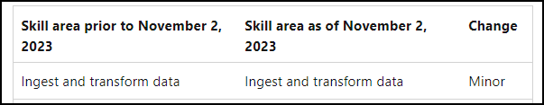

# Exam DP-203: Data Engineering on Microsoft Azure Certification Study Blueprint

## Theoretical Knowledge

* [Azure documentation](https://docs.microsoft.com/en-us/azure/)
* [Data Lake Storage Gen 2 docs](https://docs.microsoft.com/en-us/azure/storage/blobs/data-lake-storage-introduction)
* [Storage account docs](https://docs.microsoft.com/en-us/azure/storage/common/storage-account-overview)
* [Azure Synapse docs](https://docs.microsoft.com/en-us/azure/synapse-analytics/)
* [Azure Data Factory docs](https://docs.microsoft.com/en-us/azure/data-factory/introduction)
* [Azure SQL Database docs](https://docs.microsoft.com/en-us/azure/azure-sql/database/)
* [Cosmos DB docs](https://docs.microsoft.com/en-us/azure/cosmos-db/)
* [Azure Databricks docs](https://docs.microsoft.com/en-us/azure/databricks/scenarios/what-is-azure-databricks)
* [Slowly changing dimensions](https://docs.microsoft.com/en-us/learn/modules/populate-slowly-changing-dimensions-azure-synapse-analytics-pipelines/)
* [Azure Synapse: Copy and Transform Data](https://docs.microsoft.com/en-us/azure/data-factory/connector-azure-sql-data-warehouse?tabs=data-factory)
* [Azure Databricks: ETL with Scala](https://docs.microsoft.com/en-us/azure/databricks/scenarios/databricks-extract-load-sql-data-warehouse)
* [Microsoft Learn SCD tutorial](https://docs.microsoft.com/en-us/learn/modules/populate-slowly-changing-dimensions-azure-synapse-analytics-pipelines/)
* [Raspberry Pi IoT Online Simulator](https://azure-samples.github.io/raspberry-pi-web-simulator/)
* [Transact-SQL Language Reference](https://docs.microsoft.com/en-us/sql/t-sql/language-reference?view=sql-server-ver15)
* [Microsoft Fabric](https://learn.microsoft.com/en-us/fabric/get-started/microsoft-fabric-overview)
* [Microsoft Purview](https://learn.microsoft.com/en-us/purview/purview)

## Hands-on Skill Development

* [Microsoft Learn](https://docs.microsoft.com/en-us/learn/certifications/roles/data-engineer)
* [Microsoft Official Curriculum DP-203 Labs](https://github.com/MicrosoftLearning/DP-203-Data-Engineer)
* [Pluralsight](https://app.pluralsight.com/paths/skills/microsoft-exam-dp-203-data-engineering-on-microsoft-azure)
* [Cloud Academy](https://cloudacademy.com/learning-paths/dp-203-exam-preparation-data-engineering-on-microsoft-azure-3191/)
* [Log Analytics Query Playground](https://portal.loganalytics.io/demo)
* [Raspberry Pi Azure IoT Online Simulator](https://azure-samples.github.io/raspberry-pi-web-simulator/#GetStarted)

## Practice exams

* 
* [MeasureUp Official DP-203 Practice Test](https://www.measureup.com/microsoft-practice-test-dp-203-data-engineering-azure.html)
* [Microsoft Certification Practice Assessments](https://learn.microsoft.com/en-us/certifications/practice-assessments-for-microsoft-certifications)
* [Whizlabs](https://www.whizlabs.com/microsoft-azure-certification-dp-203/)
* [Tim's MeasureUp vs Whizlabs Comparison Video](https://www.youtube.com/watch?v=_aH4DbpcJWA&t=2s)
* [Udemy](https://www.udemy.com/course/data-engineering-on-microsoft-azure/)

## About the exam

* [Exam DP-203](https://docs.microsoft.com/en-us/learn/certifications/exams/dp-203)
* [DP-203 exam blueprint](https://learn.microsoft.com/en-us/credentials/certifications/resources/study-guides/dp-203#skills-measured-as-of-november-2-2023)
* [Azure Data Engineer Associate certification](https://docs.microsoft.com/en-us/learn/certifications/azure-data-engineer/)
* [Microsoft Certification Special Offers](https://www.microsoft.com/en-us/learning/offers.aspx)
* [About Online Exams](https://www.microsoft.com/en-us/learning/online-exams.aspx)
* [MS Certification Policies and FAQs](https://www.microsoft.com/en-us/learning/certification-exam-policies.aspx)
* [Pearson VUE Grievances](https://home.pearsonvue.com/microsoft/contact)
* [Tim's online testing helper video](https://www.youtube.com/watch?v=myf6r5nulj0&feature=youtu.be)
* [Tim's exam registration helper video](https://www.youtube.com/watch?v=FOFWbSYbbVI)
* [Microsoft Learn blog](https://techcommunity.microsoft.com/t5/microsoft-learn-blog/bg-p/MicrosoftLearnBlog)
* [Certification Dashboard](https://aka.ms/certdashboard)